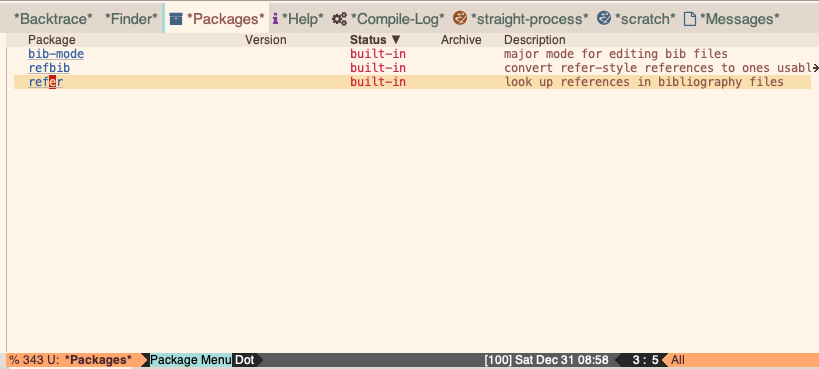

# LaTeX configuration file that works with Emacs version 28.2

## Quick start
This configuration supports writing in LaTeX and Org-mode.
Git clone to latex-emacs28 to avoid subsequent editing of file paths.

I have to use chemacs2 to run this profile parallel to the default configuration because Emacs 28.2 does not support selecting a profile on startup.
I have added the following alias to my .bashAppAliases file in my home directory to start Emacs 28 with this configuration.

```bash
e28ld='/Applications/Emacs28.2.app/Contents/MacOS/Emacs --with-profile latex28 --debug-init'
```

## Rationale
The other Emacs configurations posted on MooersLab work with Emacs 29.0.5 or emacs 30. However, many people use Emacs 28.2 and will continue to do so for several years. There are slight differences in the available features of these configurations. In addition, the packages have to be compiled with the corresponding version of the elisp compiler.

## Where it works
This configuration works with Mac OS 10.15 and Mac 13.1. It should work with Windows and Linux out of the box. On a 2018 MacBook Pro, Emacs finishes loading and garbage collecting in about 15 seconds on average. You can speed up the startup time by replacing `use-package` with `require`, but the loss of benefits from use-package outweighs the gain in reduced startup time.

## Notes
- The dashboard does not display in a buffer on startup. Invoke and switch to its buffer with Fn-F1.

- I source my yasnippets snippets folder from my default Emacs configuration by using a softlink to the snippets folder in *~./.emacs.defualt30* so adjust as needed.
I do this so that I only need to maintain one set of snippet files.
This can cause newly added snippets not to appear in the pulldown menu.
Hidden files listing the compiled snippets may be interferring with the addition of new snippets.
The solution is to enter in the snippets directory the following bash command: **rm -rf ./\*/.yas-compiled-snippets.el**. 
Then select **reload everything** from the the yasnippets pulldown menu or enter the correspoinding commands in the mini-buffer: **M-x yas-recompile-all** and **M-x yas-reload-all**.

## Structure of the init.el file
The first part of the `init.el' file has the essential package repository information followed by some basic configurations that are package indepenent.
The second part lists the package configurations in alphabetical order.
The org-aggenda and org-roam sections have my customized capture templates.
You will likely want to adjust to suit or comment out.
You may have to change the paths to the corresponding files.

## Theme
I am using the *ef-day* theme from the *ef-themes* package by Protesilaos Stavro--the humble, accomplished, and inspiring Emacsen of YouTube Fame.

<p align="center"></p>


## Related Projects on MooersLab
- [latex-emacs](https://github.com/MooersLab/latex-emacs) A configuration file supporting the use of LaTeX in Emacs.
- [Slides about Workflow in LaTeX](https://github.com/MooersLab/BerlinEmacsAugust2022) presented to the Berlin Emacs Meetup August 2022. Not recorded. It was 90-minute lecture.
- [Slideshow Template In LaTeX](https://github.com/MooersLab/slideshowTemplateLaTeX) Slideshow template in Beamer makes slides that do not look like they were made in LaTeX.
- [Poster Template In LaTeX](https://github.com/MooersLab/posterInLaTeX) Uses beamer to make a poster via a simple design. Enables whipping together a poster a few hours. It is much easier than using powerpoint.
- [LaTeX Manuscript Template](https://github.com/MooersLab/manuscriptInLaTeX/edit/main/README.md) Generic template for the first submission as a PDF.
- [Writing Log Template in LaTeX](https://github.com/MooersLab/writingLogTemplate) Place to track progress and plans behind a manuscript.
- [Annotated Bibliography Template in LaTeX](https://github.com/MooersLab/annotatedBibliography) Every writing project needs one of these.
- [Diary for 2022 in LaTeX](https://github.com/MooersLab/diary2022inLaTeX) Each day is a section. Each month is a chapter. Has an index.
- [Diary for 2023 in LaTeX](https://github.com/MooersLab/diary2023inLaTeX) 
- [Snippets for latex-mode in Emacs](https://github.com/MooersLab/snippet-latex-mode) My LaTeX code snippets for yasnippets.
- [The Writer's Creed](https://github.com/MooersLab/thewriterslaw) Guidelines for greater productivity.

